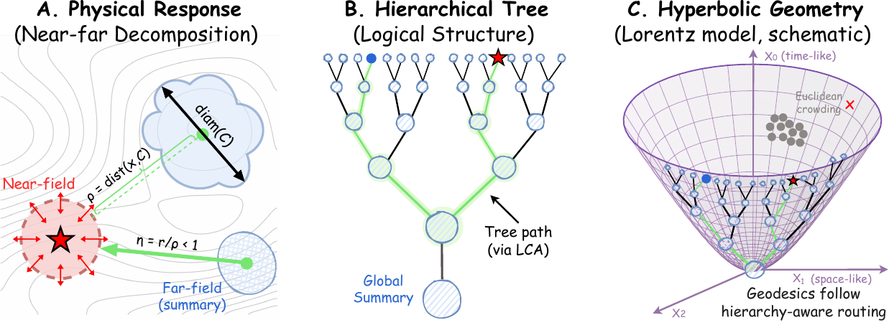

# Hyperbolic Neural Operator

🎉 **Accepted to ICML 2026.** Congratulations to all co-authors.

**Hyperbolic Neural Operator (HNO)** is a hierarchy-aware neural operator for
PDE surrogate modeling. It replaces standard dot-product routing with
stabilized Lorentz-hyperbolic distance kernels, giving the model a learned
near-field/far-field organization.

🔗 [Project page](https://guobapei.github.io/Hyperbolic-Neural-Operator/) ·
📄 [ICML page](https://icml.cc/virtual/2026/poster/65554)

<p align="center">
  
</p>

## ✨ Highlights

- Hyperbolic-distance attention for hierarchy-aware PDE operator learning.
- FMM-inspired near/far routing without hand-built trees or multipole rules.
- PDEBench scripts for Elasticity, Navier-Stokes, Darcy, Plasticity, Airfoil,
  and Pipe.
- Large-scale CFD code for AirfRANS and ShapeNetCar.
- Website source is in `docs/`.

## 🚀 Quick Start

```bash
python -m venv .venv_pdebench
source .venv_pdebench/bin/activate
python -m pip install --upgrade pip
python -m pip install -r requirements_pdebench.txt
bash scripts/smoke_test.sh
```

Run one PDEBench task:

```bash
python -m pdebench.scripts.train_darcy --data_path <DARCY_DATA_DIR>
```

Wrapper scripts are provided under `scripts/`, for example:

```bash
bash scripts/run_pdebench_all.sh <PDEBENCH_DATA_ROOT>
```

Large-scale CFD dependencies are listed separately in
`requirements_large_scale.txt`.

## 📁 Layout

```text
pdebench/       HNO models, configs, PDEBench training scripts
large_scale/    AirfRANS and ShapeNetCar code
scripts/        setup, smoke-test, and run wrappers
docs/           project website for GitHub Pages
figures/        lightweight README figures
```

Datasets, checkpoints, logs, and generated caches are not included.

## 📝 Citation

```bibtex
@inproceedings{hno2026,
  title     = {Hyperbolic Neural Operator},
  author    = {Pei, Jieyuan and Li, Zhuoxuan and Li, Wei and Zhang, Haobo and Jiang, Jiawei and Zheng, Jianwei},
  booktitle = {Proceedings of the 43rd International Conference on Machine Learning},
  series    = {Proceedings of Machine Learning Research},
  publisher = {PMLR},
  year      = {2026},
  url       = {https://icml.cc/virtual/2026/poster/65554}
}
```

## License

MIT License. See `LICENSE`.
