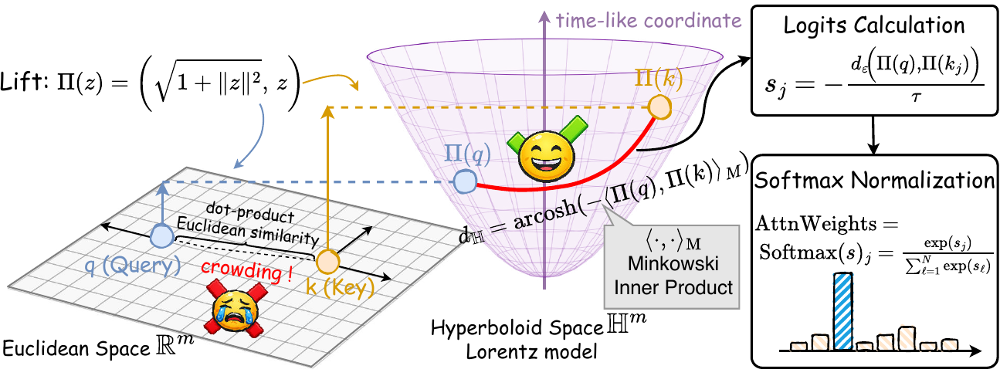
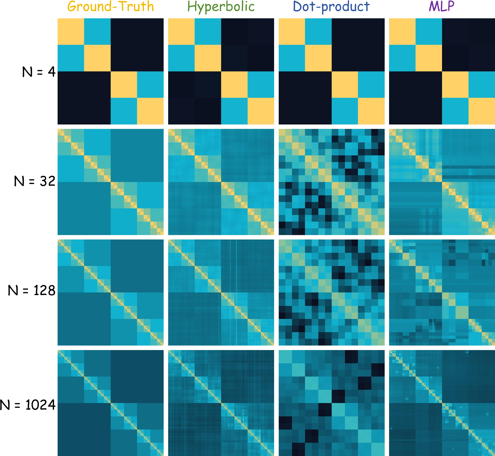
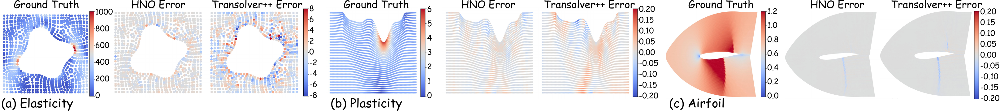
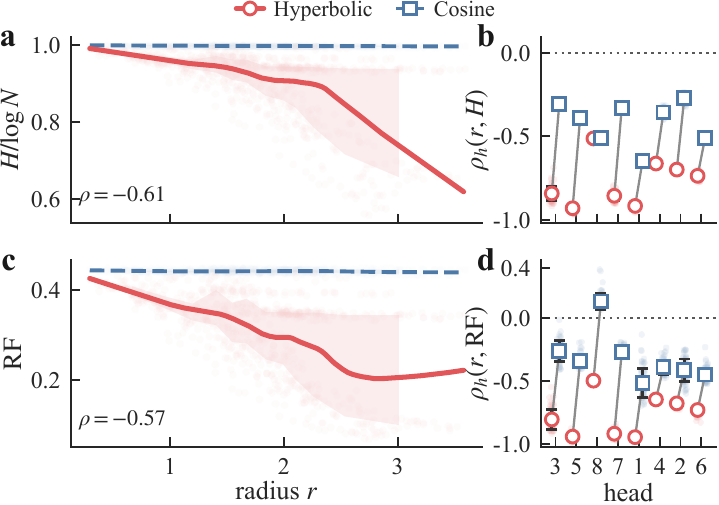

# Hyperbolic Neural Operator

**Official release code for Hyperbolic Neural Operator (HNO), ICML 2026.**

**News.** We are pleased to announce that Hyperbolic Neural Operator has been
accepted to ICML 2026. Congratulations to all co-authors.

HNO is a neural operator architecture for scientific machine learning. It uses
Lorentz-hyperbolic distance kernels to learn FMM-style near/far interaction
routing on discretized physical systems: local regions keep high-resolution
coupling, while long-range interactions are compressed through hierarchical
summaries.

Project page: https://guobapei.github.io/Hyperbolic-Neural-Operator/

<p align="center">
  
</p>

## Highlights

- **Geometry-aware operator learning.** HNO replaces dot-product token mixing
  with stabilized hyperbolic distance kernels, giving the model a natural
  hierarchy-aware bias for multiscale physical interactions.
- **FMM-inspired routing.** The architecture learns a near-field/far-field
  organization that matches the structure used by classical fast solvers.
- **Broad PDE coverage.** The release includes scripts for Elasticity,
  Navier-Stokes, Darcy, Plasticity, Airfoil, and Pipe.
- **Large-scale unstructured CFD.** AirfRANS and ShapeNetCar training code is
  included for about 32k-node mesh tasks.
- **Strong accuracy/efficiency tradeoff.** In the paper, HNO reduces average
  relative L2 error by up to about 40% against representative neural-operator
  and Transformer-style baselines, while keeping parameter count and runtime
  practical.

## Method Snapshot

HNO lifts query/key features into the Lorentz model of hyperbolic space and
uses a continuous Gibbs kernel over stabilized geodesic distance. Small-radius
tokens tend to aggregate globally, while large-radius tokens preserve local
detail, producing an interpretable hierarchy similar to classical near/far
decomposition.

<p align="center">
  
</p>

The toy multiscale tree-kernel experiment isolates the same idea in a controlled
setting: hyperbolic routing is well matched to hierarchical interaction
patterns.

<p align="center">
  
</p>

## Results Snapshot

PDEBench results across six standard PDE tasks:

<p align="center">
  
</p>

Mechanism analysis shows that the learned hyperbolic radius correlates with
global aggregation versus local interaction behavior:

<p align="center">
  
</p>

## Repository Layout

```text
hno_release_opensource/
  pdebench/
    hno/                  # HNO model variants for grid, time, and latent-set settings
    scripts/              # training entry points for PDEBench tasks
    utils/                # losses, normalizers, and numerical utilities
    configs/              # paper default hyperparameters
  large_scale/
    airfrans/             # AirfRANS training code
    shapenetcar/          # ShapeNetCar training code
  figures/                # paper figures used in this README
  scripts/                # setup, smoke test, and run wrappers
  requirements_*.txt      # dependency lists
```

No datasets, checkpoints, logs, or generated cache files are included.

## Installation

The code is tested as a source checkout. Python 3.9+ and PyTorch are
recommended. Install the PyTorch build that matches your CUDA driver first if
you need GPU acceleration.

For PDEBench:

```bash
python -m venv .venv_pdebench
source .venv_pdebench/bin/activate
python -m pip install --upgrade pip
python -m pip install -r requirements_pdebench.txt
```

or use the helper:

```bash
bash scripts/setup_pdebench_env.sh
```

For AirfRANS and ShapeNetCar, use the separate dependency file:

```bash
python -m venv .venv_large_scale
source .venv_large_scale/bin/activate
python -m pip install --upgrade pip
python -m pip install -r requirements_large_scale.txt
```

The large-scale tasks depend on compiled geometry/GNN packages such as
`torch_geometric`, `torch_scatter`, `torch_sparse`, `pyvista`, and `vtk`.
Installation can vary by platform and PyTorch/CUDA version; follow the official
PyG wheels if the generic requirement install fails.

## Quick Check

Run a source-level smoke test without any dataset:

```bash
bash scripts/smoke_test.sh
```

This checks Python syntax and imports the package entry points.

## Data Layout

By default, PDEBench scripts look for data under `data/pdebench/`:

```text
data/pdebench/
  darcy/
    piececonst_r421_N1024_smooth1.mat
    piececonst_r421_N1024_smooth2.mat
  navier-stokes/
    NavierStokes_V1e-5_N1200_T20.mat
  airfoil/naca/
    NACA_Cylinder_X.npy
    NACA_Cylinder_Y.npy
    NACA_Cylinder_Q.npy
  pipe/
    Pipe_X.npy
    Pipe_Y.npy
    Pipe_Q.npy
  plasticity/
    plas_N987_T20.mat
  elasticity/
    Meshes/
      Random_UnitCell_sigma_10.npy
      Random_UnitCell_XY_10.npy
```

You can also pass `--data_path` directly to each script.

For AirfRANS, pass a data directory containing `manifest.json` and the CFD
files expected by `large_scale/airfrans/dataset/dataset.py`.

For ShapeNetCar, pass the raw data directory with `--data_dir` and a
preprocessed/cache directory with `--save_dir`.

## PDEBench Commands

Single-task entry points:

```bash
python -m pdebench.scripts.train_darcy --data_path <DARCY_DATA_DIR>
python -m pdebench.scripts.train_navier_stokes --data_path <NAVIER_STOKES_DATA_DIR>
python -m pdebench.scripts.train_airfoil --data_path <AIRFOIL_NACA_DATA_DIR>
python -m pdebench.scripts.train_pipe --data_path <PIPE_DATA_DIR>
python -m pdebench.scripts.train_plasticity --data_path <PLASTICITY_MAT_FILE>
python -m pdebench.scripts.train_elasticity --data_path <ELASTICITY_DATA_DIR>
```

Wrapper scripts expect a shared PDEBench root with the layout above:

```bash
bash scripts/run_pdebench_darcy.sh <PDEBENCH_DATA_ROOT>
bash scripts/run_pdebench_navier_stokes.sh <PDEBENCH_DATA_ROOT>
bash scripts/run_pdebench_airfoil.sh <PDEBENCH_DATA_ROOT>
bash scripts/run_pdebench_pipe.sh <PDEBENCH_DATA_ROOT>
bash scripts/run_pdebench_plasticity.sh <PDEBENCH_DATA_ROOT>
bash scripts/run_pdebench_elasticity.sh <PDEBENCH_DATA_ROOT>
bash scripts/run_pdebench_all.sh <PDEBENCH_DATA_ROOT>
```

Paper default hyperparameters are in `pdebench/configs/best_configs.yaml` and
are also exposed as command-line defaults in the training scripts.

## Large-Scale CFD Commands

AirfRANS:

```bash
python large_scale/airfrans/main.py \
  --data_dir <AIRFRANS_DATA_DIR> \
  --save_dir outputs/airfrans \
  --task full
```

or:

```bash
bash scripts/run_airfrans.sh <AIRFRANS_DATA_DIR>
```

ShapeNetCar:

```bash
python large_scale/shapenetcar/main.py \
  --data_dir <SHAPENETCAR_RAW_DATA_DIR> \
  --save_dir <SHAPENETCAR_PREPROCESSED_DIR> \
  --output_dir outputs/shapenetcar
```

or:

```bash
bash scripts/run_shapenetcar.sh <SHAPENETCAR_RAW_DATA_DIR> <SHAPENETCAR_PREPROCESSED_DIR>
```

## Outputs

Training outputs are written under `outputs/` by default. Checkpoints, logs,
intermediate metrics, and visualization outputs are ignored by Git.

## Citation

If you use this code, please cite:

```bibtex
@inproceedings{hno2026,
  title     = {Hyperbolic Neural Operator},
  author    = {Pei, Jieyuan and Li, Zhuoxuan and Li, Wei and Zhang, Haobo and Jiang, Jiawei and Zheng, Jianwei},
  booktitle = {Proceedings of the 43rd International Conference on Machine Learning},
  series    = {Proceedings of Machine Learning Research},
  volume    = {306},
  publisher = {PMLR},
  year      = {2026}
}
```

## License

This code is released under the MIT License. See `LICENSE` for details.
